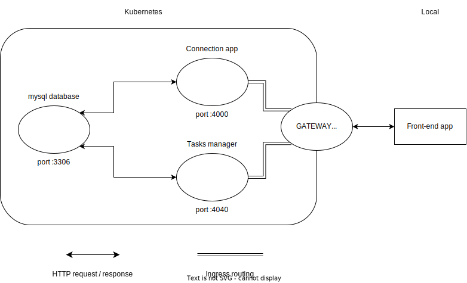
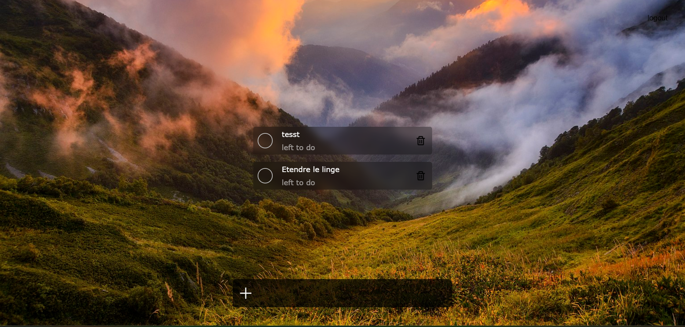

# Kubernetes Project
*by Pablo Ratouit & Gwendal Roux*

## Project Overview
The goal of this project was to create a kubernetes environment where at least 2 web services were deployed and 1 database.
Each one of them are located in a unique Kubernetes cluster and can interact with each other. 
On top of that, a front-end application can access the different services.

The project consist on a Todo list application which save the user inputs inside a database and ask for connection to retrieve them.

**Here is a scheme of the project architecture**

**Screenshot of the application once connected**

### Database
For this project, we use a mysql server wihich is running in a kubernetes pods. The pod has its own volune which allows data to be kept in between restart of the pod.
The database uses the port 3306 to communicate with the services.

### Connection service
We wanted users to be able to connect to our service and have their personal data in the database.
To achieve that, we created an NodeJS application using the Express framework which handle the connection form sent by the front-end.
It return a JWT token if the connection succeed.
It does not support username or password modification, neither removing user from database.

### Task service
This service deals with the tasks entered by users and manage their status, their name and the delete action.
As the connection service, it is made with Express and NodeJS, and it contains multiple functions accessible by different URL.

### Front-end
The front-end is handle by a React application. After user entered his credentials, the tasks created by him are fetch and display, then he can interract with them.

---

## Kubernetes architecture
To run, the minikube needs to launch 3 different pods :
- mysql
- connection-server
- task-manager

For both services, the different images containing the corresponing application is pull fron Docker Hub, and then launch inside the container.
Each service runs on a specific port and the TCP is configured to authorized the connection.
In addition, an ingress service is also running to configure a gateway and therefore create a route for each service on the same host.
This allow the front-end application to use the adress to connect and fetch data.
